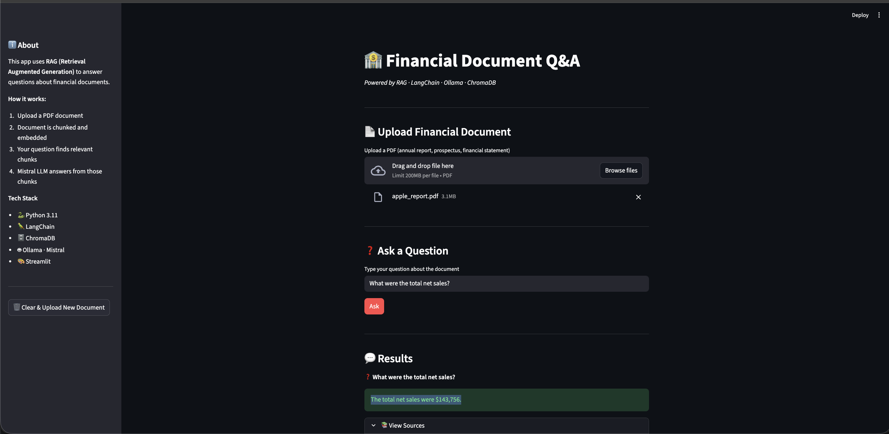

# 🏦 Financial Document Q&A — RAG Pipeline

An AI-powered web app that answers questions about financial documents 
using Retrieval Augmented Generation (RAG) — built with Python, 
LangChain, ChromaDB, Ollama and Streamlit.

## 🎯 What It Does

Upload any financial PDF — annual reports, fund prospectuses, 
financial statements — and ask questions in plain English. 
The system retrieves the most relevant sections and generates 
accurate, grounded answers with source references.

## 📸 Demo



## 💡 How It Works
```
PDF Upload
    ↓
Load & Split into chunks (500 chars, 50 overlap)
    ↓
Embed chunks → ChromaDB vector store (Mistral embeddings)
    ↓
User asks question
    ↓
Semantic search → Top 3 relevant chunks retrieved
    ↓
Mistral LLM answers from retrieved context
    ↓
Answer + Source references displayed
```

## 🛠️ Tech Stack

- **Python 3.11**
- **LangChain** — RAG pipeline orchestration
- **ChromaDB** — Local vector database
- **Ollama + Mistral** — Local LLM, no API key needed
- **Streamlit** — Web UI
- **PyPDF** — PDF loading

## 🚀 How To Run

**1. Install Ollama and pull Mistral**
```bash
# Install from https://ollama.ai
ollama pull mistral
ollama run mistral
```

**2. Clone and set up Python environment**
```bash
git clone https://github.com/Vin31880/rag-financial-qa.git
cd rag-financial-qa
python3.11 -m virtualenv venv
source venv/bin/activate
pip install -r requirements.txt
```

**3. Run the app**
```bash
streamlit run app.py
```

**4. Open browser at** `http://localhost:8501`

## 📋 Sample Questions to Try

- *"What were the total net sales?"*
- *"What are the key financial highlights?"*
- *"What risks are mentioned in the document?"*
- *"How much cash does the company hold?"*
- *"What is the revenue growth compared to last year?"*

## 🏗️ Project Structure
```
rag-financial-qa/
├── app.py              ← Streamlit web UI
├── rag_chain.py        ← Core RAG pipeline logic
├── requirements.txt    ← Python dependencies
└── README.md
```

## 🔗 Related Project

This project is the Python complement to my Java-based AI work:  
👉 [Sales Monitoring System with AI Insights Layer](https://github.com/Vin31880/Sales-Monitoring)  
— LangChain4j + Ollama + Spring Boot anomaly detection

## 👤 Author

Vinayak Jaybhaye — Senior AI Engineer  
[LinkedIn](https://linkedin.com/in/vinayak-jaybhaye58b41162) · 
[GitHub](https://github.com/Vin31880)